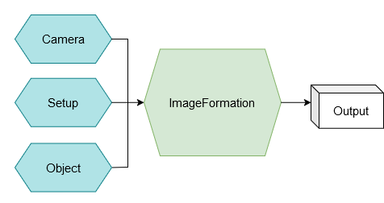
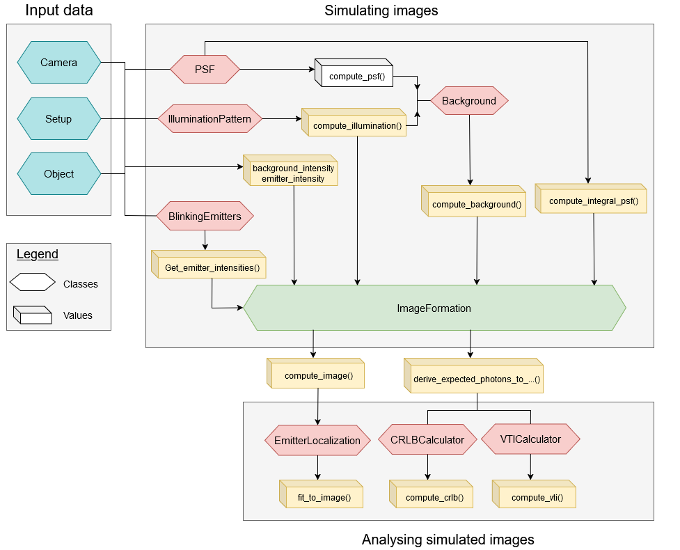

[//]: # (# Project Simulating image Formation models)

[//]: # ()
[//]: # ()
[//]: # ()
[//]: # (## Getting started)

[//]: # ()
[//]: # (To make it easy for you to get started with GitLab, here's a list of recommended next steps.)

[//]: # ()
[//]: # (Already a pro? Just edit this README.md and make it your own. Want to make it easy? [Use the template at the bottom]&#40;#editing-this-readme&#41;!)

[//]: # ()
[//]: # (## Add your files)

[//]: # ()
[//]: # (- [ ] [Create]&#40;https://docs.gitlab.com/ee/user/project/repository/web_editor.html#create-a-file&#41; or [upload]&#40;https://docs.gitlab.com/ee/user/project/repository/web_editor.html#upload-a-file&#41; files)

[//]: # (- [ ] [Add files using the command line]&#40;https://docs.gitlab.com/ee/gitlab-basics/add-file.html#add-a-file-using-the-command-line&#41; or push an existing Git repository with the following command:)

[//]: # ()
[//]: # (```)

[//]: # (cd existing_repo)

[//]: # (git remote add origin https://gitlab.tudelft.nl/qnano/project-simulating-image-formation-models.git)

[//]: # (git branch -M main)

[//]: # (git push -uf origin main)

[//]: # (```)

[//]: # ()
[//]: # (## Integrate with your tools)

[//]: # ()
[//]: # (- [ ] [Set up project integrations]&#40;https://gitlab.tudelft.nl/qnano/project-simulating-image-formation-models/-/settings/integrations&#41;)

[//]: # ()
[//]: # (## Collaborate with your team)

[//]: # ()
[//]: # (- [ ] [Invite team members and collaborators]&#40;https://docs.gitlab.com/ee/user/project/members/&#41;)

[//]: # (- [ ] [Create a new merge request]&#40;https://docs.gitlab.com/ee/user/project/merge_requests/creating_merge_requests.html&#41;)

[//]: # (- [ ] [Automatically close issues from merge requests]&#40;https://docs.gitlab.com/ee/user/project/issues/managing_issues.html#closing-issues-automatically&#41;)

[//]: # (- [ ] [Enable merge request approvals]&#40;https://docs.gitlab.com/ee/user/project/merge_requests/approvals/&#41;)

[//]: # (- [ ] [Set auto-merge]&#40;https://docs.gitlab.com/ee/user/project/merge_requests/merge_when_pipeline_succeeds.html&#41;)

[//]: # ()
[//]: # (## Test and Deploy)

[//]: # ()
[//]: # (Use the built-in continuous integration in GitLab.)

[//]: # ()
[//]: # (- [ ] [Get started with GitLab CI/CD]&#40;https://docs.gitlab.com/ee/ci/quick_start/index.html&#41;)

[//]: # (- [ ] [Analyze your code for known vulnerabilities with Static Application Security Testing &#40;SAST&#41;]&#40;https://docs.gitlab.com/ee/user/application_security/sast/&#41;)

[//]: # (- [ ] [Deploy to Kubernetes, Amazon EC2, or Amazon ECS using Auto Deploy]&#40;https://docs.gitlab.com/ee/topics/autodevops/requirements.html&#41;)

[//]: # (- [ ] [Use pull-based deployments for improved Kubernetes management]&#40;https://docs.gitlab.com/ee/user/clusters/agent/&#41;)

[//]: # (- [ ] [Set up protected environments]&#40;https://docs.gitlab.com/ee/ci/environments/protected_environments.html&#41;)

[//]: # (***)

# Project Simulating Image Formation Models README

***
Welcome to PSF! Project Simulating Image Formation Models is a Single Molecule Localization Microscopy (SMLM) project that aims to simulate the image formation models of different SMLM systems. This code aims to simulate images captured by a fluorescence microscope. Here, we have fluorescent emitters that reside in a homogeneous sample, which are illuminated by an illumination pattern (excitation beam). This results in fluorescence that is captured by the camera, where we assume that the fluorescence can be spectrally separated from the illumination.

## Table of Contents
***
- [Installation](#installation)
- [Structure](#structure)
- [Usage](#Usage)
- [License](#license)

## Installation
***

1. **Clone the repository** (or [download the ZIP](https://docs.github.com/en/repositories/creating-and-managing-repositories/cloning-a-repository)):

    ```bash
    git clone https://github.com/username/project-simulating-image-formation-models.git
    cd project-simulating-image-formation-models
    ```


2. **Install [Miniconda](https://docs.conda.io/en/latest/miniconda.html) or [Anaconda](https://www.anaconda.com/products/distribution)** if you haven't already.


3. **Create a new environment** from the `environment.yml`:

    ```bash
    conda env create -f environment.yml
    ```
    
    This file has the environment name set to **SIFM** by default, so Conda will automatically name the environment “SIFM.”


## Structure 
***
The structure of the project is as follows:
### Classes
This simulator uses a number of classes to simulate the images. In general, there are three dataclasses `Object`, `Setup` and `Camera` that contain all input parameters. These are passed through the `ImageFormation` class, which uses the Image Formation Model to compute the expected photon count of all pixels. This is illustrated by the Figure below.



The Image Formation Model computes the expected photon count of a pixel, denoted by `photons_per_pixel`. To compute this `photons_per_pixel`, one needs to know what the illumination pattern and the detection PSF look like. The classes `IlluminationPattern` and `PSF` are responsible for computing the illumination pattern and PSF, which not only contain these expressions itself but also the derivatives of these functions. The Figure below displays a flow chart of how the classes are related to each other.



The Figure above also shows the `Background` class that outputs variable `patterned_background`. This is used to determine the expected background photon count. In the Image Formation Models that we have used, `Background` takes the illumination pattern and the detection PSF as input as well, together with the system parameters given in the data classes.

Furthermore, in the above Figure, the yellow intermediate values are used by `ImageFormation` to compute the final results. Besides `photons_per_pixel`, this class also outputs the derivatives of `photons_per_pixel` with respect to the emitter positions and brightnesses. The emitter positions are denoted as `xemit`, `yemit` and `zemit` in the `Object` class. In this class, the emitter brightness is given by `emitter_intensity` and the expected background count from the emitter is given by `background_intensity`. Note that we have 2 different background parameters; `background_intesity` and `patterned_background`, which is dependent of the illumination pattern and the detection PSF and is computed by `ImageFormation`. The product of these two background terms gives the expected background photon count in a pixel. 

### Usage

The notebook `example.ipynb` shows how to instantiate the classes and which methods to use in order to compute the necessary components to use the Image Formation Modell.
### .py Scripts

Almost all classes are in their own separate python files: `PSF`, `IlluminationPattern`, `Background` and `ImageFormation` reside in `psf_models.py`, `illumination_pattern.py`, `background.py` and `image_formation.py` respectively. The three dataclasses that contain the simulation parameters (`Object`, `Setup` and `Camera`) are in `simulation_params.py`.

## Contributing

Pull requests are welcome. For major changes, please open an issue first
to discuss what you would like to change.

Please make sure to update tests as appropriate.

## License

This project is licensed under the [MIT](https://choosealicense.com/licenses/mit/) license.

[//]: # (# Editing this README)

[//]: # ()
[//]: # (When you're ready to make this README your own, just edit this file and use the handy template below &#40;or feel free to structure it however you want - this is just a starting point!&#41;. Thanks to [makeareadme.com]&#40;https://www.makeareadme.com/&#41; for this template.)

[//]: # ()
[//]: # (## Suggestions for a good README)

[//]: # ()
[//]: # (Every project is different, so consider which of these sections apply to yours. The sections used in the template are suggestions for most open source projects. Also keep in mind that while a README can be too long and detailed, too long is better than too short. If you think your README is too long, consider utilizing another form of documentation rather than cutting out information.)

[//]: # ()
[//]: # ()
[//]: # (## Installation)

[//]: # (Within a particular ecosystem, there may be a common way of installing things, such as using Yarn, NuGet, or Homebrew. However, consider the possibility that whoever is reading your README is a novice and would like more guidance. Listing specific steps helps remove ambiguity and gets people to using your project as quickly as possible. If it only runs in a specific context like a particular programming language version or operating system or has dependencies that have to be installed manually, also add a Requirements subsection.)

[//]: # ()
[//]: # (## Usage)

[//]: # (Use examples liberally, and show the expected output if you can. It's helpful to have inline the smallest example of usage that you can demonstrate, while providing links to more sophisticated examples if they are too long to reasonably include in the README.)

[//]: # ()
[//]: # (## Support)

[//]: # (Tell people where they can go to for help. It can be any combination of an issue tracker, a chat room, an email address, etc.)

[//]: # ()
[//]: # (## Roadmap)

[//]: # (If you have ideas for releases in the future, it is a good idea to list them in the README.)

[//]: # ()
[//]: # (## Contributing)

[//]: # (State if you are open to contributions and what your requirements are for accepting them.)

[//]: # ()
[//]: # (For people who want to make changes to your project, it's helpful to have some documentation on how to get started. Perhaps there is a script that they should run or some environment variables that they need to set. Make these steps explicit. These instructions could also be useful to your future self.)

[//]: # ()
[//]: # (You can also document commands to lint the code or run tests. These steps help to ensure high code quality and reduce the likelihood that the changes inadvertently break something. Having instructions for running tests is especially helpful if it requires external setup, such as starting a Selenium server for testing in a browser.)

[//]: # ()
[//]: # (## Authors and acknowledgment)

[//]: # (Show your appreciation to those who have contributed to the project.)

[//]: # ()
[//]: # (## License)

[//]: # (For open source projects, say how it is licensed.)

[//]: # ()
[//]: # (## Project status)

[//]: # (If you have run out of energy or time for your project, put a note at the top of the README saying that development has slowed down or stopped completely. Someone may choose to fork your project or volunteer to step in as a maintainer or owner, allowing your project to keep going. You can also make an explicit request for maintainers.)
